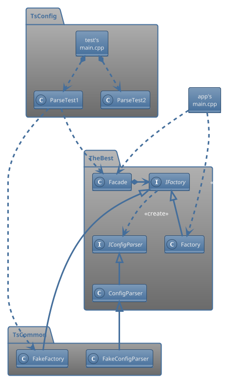
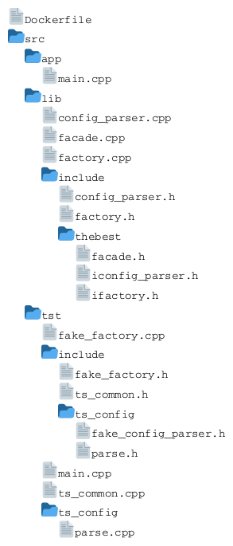

# BDD/TDD-based Software Development for Engineering Projects <!-- omit from toc -->

## Table of contents  <!-- omit from toc -->

<!-- This TOC is generated using the "Markdown All in One" vscode extension -->
- [Introduction](#introduction)
- [Class diagram](#class-diagram)
- [Directory structure](#directory-structure)
	- [Under `./thebest`](#under-thebest)
	- [Under `./fileio`](#under-fileio)
- [To build](#to-build)
	- [Step 1: Docker setup](#step-1-docker-setup)
	- [Step 2a: Building `thebestapp`](#step-2a-building-thebestapp)
	- [Step 2b: Building `thebestts`](#step-2b-building-thebestts)

## Introduction

Design guidelines for starting a new app/lib with BDD/TDD in mind.

## Class diagram

<!--

<!--
-->


## Directory structure

> Note: ts &rarr; test suite

### Under `./thebest`

<!--

<!--
-->


### Under `./fileio`

(TODO)

## To build

If you don't have an up-to-date GCC compiler suite already installed, do Step 1.  
Otherwise, cd to `./thebest` and do Step 2 (a, b, or both).

### Step 1: Docker setup

From within `./thebest`, run:

```bash
docker run -it --rm --name thebest -v "$PWD":/home/project -w /home/project abeimler/simple-cppbuilder /bin/bash
```

Then, once in the container (in `/home/project`), do Step 2 (a, b, or both).

### Step 2a: Building `thebestapp`

From within `./src/app`, run:

```bash
c++ -std=c++23 -I ../lib/include/ -o thebestapp main.cpp ../lib/facade.cpp ../lib/factory.cpp ../lib/config_parser.cpp
```

### Step 2b: Building `thebestts`

From within `./src/tst`, run:

```bash
c++ -std=c++23 -I ./include -I ../lib/include/ -o thebestts main.cpp ts_common.cpp fake_factory.cpp ts_config/parse.cpp ../lib/facade.cpp ../lib/factory.cpp ../lib/config_parser.cpp
```
