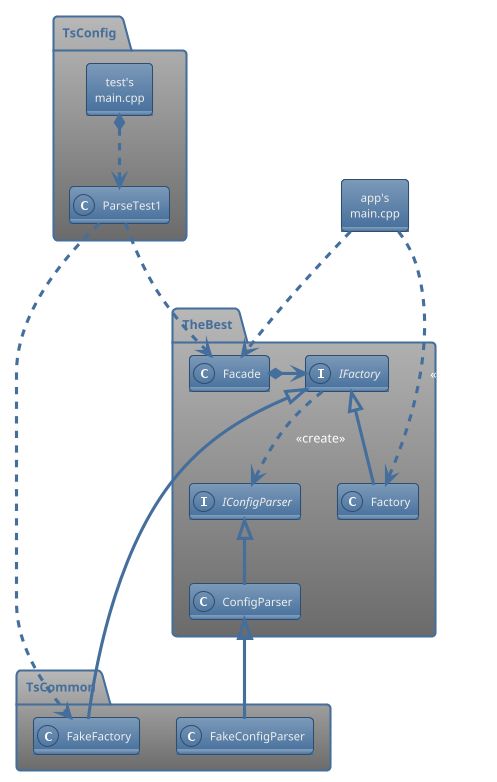
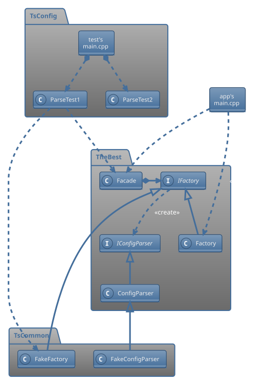
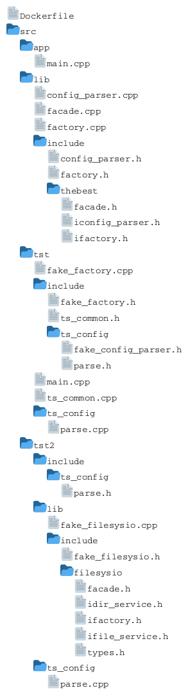
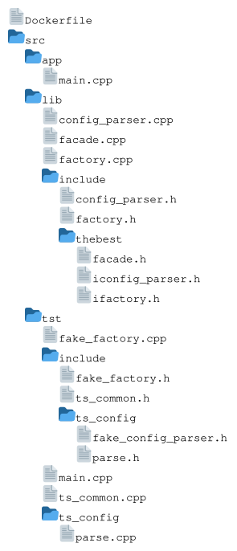
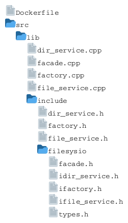
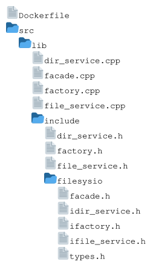

# BDD/TDD-based Software Development for Engineering Projects <!-- omit from toc -->

## Table of contents  <!-- omit from toc -->

<!-- This TOC is generated using the "Markdown All in One" vscode extension -->
- [Introduction](#introduction)
- [Class diagram](#class-diagram)
- [Directory structure](#directory-structure)
	- [Under `./thebest`](#under-thebest)
	- [Under `./filesysio`](#under-filesysio)
- [To build thebest repo](#to-build-thebest-repo)
	- [Step 1: Docker setup for thebest](#step-1-docker-setup-for-thebest)
	- [Step 2a: Building `thebestapp`](#step-2a-building-thebestapp)
	- [Step 2b: Building `thebestts`](#step-2b-building-thebestts)
- [To build the filesysio repo](#to-build-the-filesysio-repo)
	- [Step 1: Docker setup for filesysio](#step-1-docker-setup-for-filesysio)
	- [Step 2: Building `filesysio.a`](#step-2-building-filesysioa)
- [To build the thebest repo using the filesysio lib](#to-build-the-thebest-repo-using-the-filesysio-lib)
	- [Step 1: Copy the filesysio's files](#step-1-copy-the-filesysios-files)
	- [Step 2: Docker setup](#step-2-docker-setup)
	- [Step 3a: Building `thebestapp2`](#step-3a-building-thebestapp2)
	- [Step 3b: Building `thebestts2`](#step-3b-building-thebestts2)

## Introduction

Design guidelines for starting a new app/lib with BDD/TDD in mind.

## Class diagram

<!--

<!--
-->


## Directory structure

> Note: ts &rarr; test suite

### Under `./thebest`

<!--

<!--
-->


### Under `./filesysio`

<!--

<!--
-->


## To build thebest repo

If you don't have an up-to-date GCC compiler suite already installed, do Step 1.  
Otherwise, cd to `./thebest` and do Step 2 (a, or b, or both).

### Step 1: Docker setup for thebest

From within `./thebest`, run:

```bash
./runbuildenv.sh
```

This will start a container and you'll end up in `/home/project`). Then do Step 2 (a, or b, or both).

### Step 2a: Building `thebestapp`

From within the container, in `/home/project`, run:

```bash
./buildapp.sh
```

### Step 2b: Building `thebestts`

From within the container, in `/home/project`, run:

```bash
./buildtst.sh
```

If you run the test-app:

```bash
./src/tst/build/thebestts
```

it should output:

```text
INFO: Starting ParseTest1
ERROR: ParseTest1: Could not open file: ts_artifacts/config1.xml
FAILED : ParseTest1

FAILURE: At least one test didn't pass
```

## To build the filesysio repo

If you don't have an up-to-date GCC compiler suite already installed, do Step 1.  
Otherwise, cd to `./filesysio` and do Step 2 (a, or b, or both).

### Step 1: Docker setup for filesysio

From within `./filesysio`, run:

```bash
./runbuildenv.sh
```

This will start a container and you'll end up in `/home/project`). Then do Step 2 (a, or b, or both).

### Step 2: Building `filesysio.a`

From within the container, in `/home/project`, run:

```bash
./buildlib.sh
```

## To build the thebest repo using the filesysio lib

> Note: You need to build the filesysio repo first.

### Step 1: Copy the filesysio's files

From outside any container, in `./thebest`, run:

```bash
./copyfilesysio.sh
```

Notes:
- You may need to *chown* `libfilesysio.a` before you can copy it.

### Step 2: Docker setup

If not already done, from within `./thebest`, run:

```bash
./runbuildenv.sh
```

This will start a container and you'll end up in `/home/project`). Then do Step 3.

### Step 3a: Building `thebestapp2`

From within the container, in `/home/project`, run:

```bash
./buildapp2.sh
```

If you run the app:

```bash
./src/app/build/thebestapp2
```

it should output:

```text
The file config.xml does not exist
```

### Step 3b: Building `thebestts2`

From within the container, in `/home/project`, run:

```bash
./buildtst2.sh
```

If you run the test-app:

```bash
./src/tst2/build/thebestts2
```

it should output:

```text
INFO: Starting ParseTest1
ERROR: ParseTest1: Could not open file: ts_artifacts/config1.xml
FAILED : ParseTest1
INFO: Starting ParseTest2
This
is
a
test
SUCCESS: ParseTest2

FAILURE: At least one test didn't pass
```
