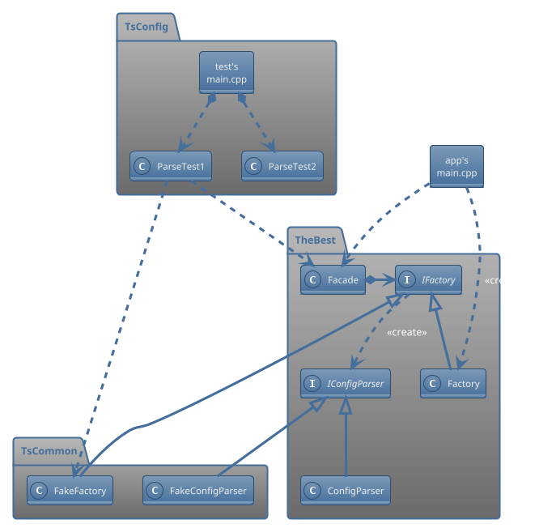

# BDD/TDD-based Software Development for Engineering Projects

Design guidelines for starting a new app/lib with BDD/TDD in mind.

## Class diagram



## To build

### thebestapp

From within thebest/src/app, run:

```bash
c++ -std=c++23 -I ../lib/include/ -o thebestapp main.cpp ../lib/facade.cpp ../lib/factory.cpp ../lib/config_parser.cpp
```

### thebestts

From within thebest/src/tst, run:

```bash
c++ -std=c++23 -I . -I ../lib/include/ -o thebestts main.cpp ts_common.cpp fake_factory.cpp ts_config/parse.cpp ../lib/facade.cpp ../lib/factory.cpp ../lib/config_parser.cpp
```
