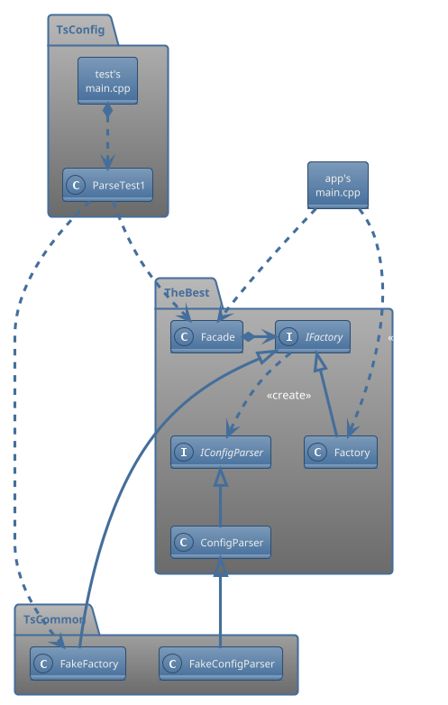
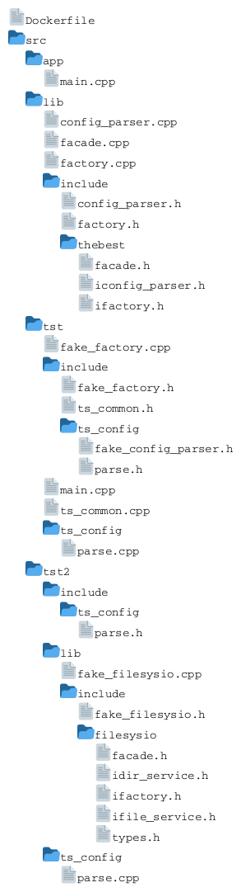
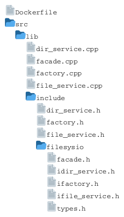

# BDD/TDD-based Software Development for Engineering Projects <!-- omit from toc -->

## Table of contents  <!-- omit from toc -->

<!-- This TOC is generated using the "Markdown All in One" vscode extension -->
- [Introduction](#introduction)
- [Class diagram](#class-diagram)
- [Directory structure](#directory-structure)
	- [Under `./thebest`](#under-thebest)
	- [Under `./filesysio`](#under-filesysio)
- [To build thebest repo](#to-build-thebest-repo)
	- [Step 1: Docker setup](#step-1-docker-setup)
	- [Step 2a: Building `thebestapp`](#step-2a-building-thebestapp)
	- [Step 2b: Building `thebestts`](#step-2b-building-thebestts)
- [To build the filesysio repo](#to-build-the-filesysio-repo)
	- [Step 2: Building `filesysio.a`](#step-2-building-filesysioa)
- [To build the thebest repo using the filesysio lib](#to-build-the-thebest-repo-using-the-filesysio-lib)
	- [Step 1: Copy the filesysio's files](#step-1-copy-the-filesysios-files)
	- [Step 2: Docker setup](#step-2-docker-setup)
	- [Step 3a: Building `thebestapp2`](#step-3a-building-thebestapp2)
	- [Step 3b: Building `thebestts2`](#step-3b-building-thebestts2)

## Introduction

Design guidelines for starting a new app/lib with BDD/TDD in mind.

## Class diagram

<!--

<!--
-->


## Directory structure

> Note: ts &rarr; test suite

### Under `./thebest`

<!--

<!--
-->


### Under `./filesysio`

<!--

<!--
-->


## To build thebest repo

If you don't have an up-to-date GCC compiler suite already installed, do Step 1.  
Otherwise, cd to `./thebest` and do Step 2 (a, b, or both).

### Step 1: Docker setup

From within `./thebest`, run:

```bash
docker run -it --rm --name thebest -v "$PWD":/home/project -w /home/project abeimler/simple-cppbuilder /bin/bash
```

Then, once in the container (in `/home/project`), do Step 2 (a, b, or both).

### Step 2a: Building `thebestapp`

From within `./src/app`, run:

```bash
mkdir build
c++ -std=c++23 -I ../lib/include/ -o ./build/thebestapp `find . ../lib -name '*.cpp' -print`
```

### Step 2b: Building `thebestts`

From within `./src/tst`, run:

```bash
mkdir build
c++ -std=c++23 -I ./include -I ../lib/include/ -o ./build/thebestts `find . ../lib -name '*.cpp' -print`
```

If you run the test-app:

```bash
./build/thebestts
```

it should output:

```text
INFO: Starting ParseTest1
ERROR: ParseTest1: Could not open file: ts_artifacts/config1.xml
FAILED : ParseTest1

FAILURE: At least one test didn't pass
```

## To build the filesysio repo

Do Step 1 from previous section but replace `--name thebest` by `--name filesysio`.

From within `./filesyio`, run:

```bash
docker run -it --rm --name filesysio -v "$PWD":/home/project -w /home/project abeimler/simple-cppbuilder /bin/bash
```

### Step 2: Building `filesysio.a`

Once inside the container (in `/home/project`), from within `./src/lib`, run:

```bash
mkdir build
find . -maxdepth 1 -name '*.cpp' -exec c++ -c -fPIC -std=c++23 -I ./include/ -o build/{}.o {} \;
ar rfs ./build/libfilesysio.a build/*.o
```

## To build the thebest repo using the filesysio lib

> Note: You need to build the filesysio repo first.

### Step 1: Copy the filesysio's files

Since the thebest and filesysio porjects are not able to see each other when inside a container, from outside of any container, copy the following files:

- public `.h` files
  - from: filesysio's `src/lib/include/filesysio/`
  - to: thebest's `src/tst2/lib/include/filesysio/`
- the `libfilesysio.a` file
  - from: filesysio's `src/lib/build`
  - to: thebest's `./src/tst2/build/`

Notes:
- You may need to create the destination folders.
- You may need to chown `libfilesysio.a` before you can copy it.

### Step 2: Docker setup

From within `./thebest`, run:

```bash
docker run -it --rm --name thebest -v "$PWD":/home/project -w /home/project abeimler/simple-cppbuilder /bin/bash
```

Then, once in the container (in `/home/project`), do Step 3.

### Step 3a: Building `thebestapp2`

```bash
c++ -std=c++23 -DUSE_FILESYSIO_LIB -I ../lib/include/ -I ../tst2/lib/include -o ./build/thebestapp2 `find . ../lib -name '*.cpp' -print` -L ../tst2/build -lfilesysio
```

If you run the app:

```bash
./build/thebestapp2
```

it should output:

```text
The file config.xml does not exist
```

### Step 3b: Building `thebestts2`

From within `./src/tst2`, run:

```bash
c++ -std=c++23 -DUSE_FILESYSIO_LIB -o build/thebestts2 -I ./include -I ../tst2/lib/include -I ../tst/include -I ../lib/include -I ./lib/include ./ts_config/parse.cpp ./lib/fake_filesysio.cpp ../tst/main.cpp ../tst/fake_factory.cpp ../tst/ts_common.cpp ../lib/config_parser.cpp ../lib/factory.cpp ../lib/facade.cpp
```

If you run the test-app:

```bash
./build/thebestts2
```

it should output:

```text
INFO: Starting ParseTest1
ERROR: ParseTest1: Could not open file: ts_artifacts/config1.xml
FAILED : ParseTest1
INFO: Starting ParseTest2
This
is
a
test
SUCCESS: ParseTest2

FAILURE: At least one test didn't pass
```
